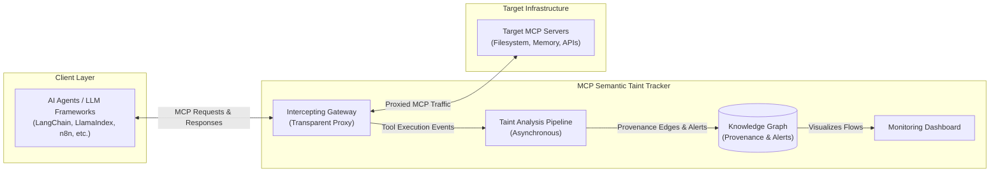
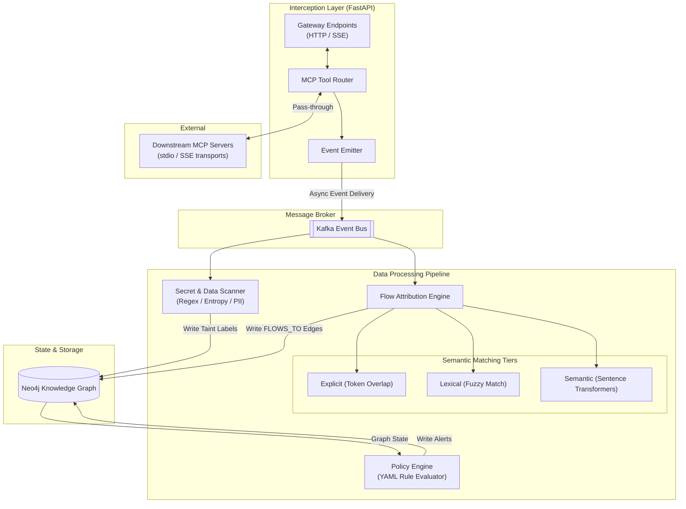

# MCP Semantic Taint Tracker

**Multi-hop data-flow tracing across LLM tool ecosystems.**

[](https://python.org)
[](https://fastapi.tiangolo.com)
[](https://neo4j.com)
[](LICENSE)
[](https://kafka.apache.org)
[](https://docker.com)
[](https://n8n.io)
[](https://opentelemetry.io)
[](https://pydantic.dev)
[](https://networkx.org)
[](https://sbert.net)

---

## The Problem

LLM agents powered by the **Model Context Protocol (MCP)** chain together dozens of tools — filesystem readers, database clients, webhooks, memory stores, credential vaults, and more.

Today's guardrails focus on **input-level checks**: prompt injection filters, content safety classifiers, and output scanners. But they share a blind spot:

> **What happens when data flows *between* tools?**

A compromised tool (e.g., a memory store whose tool descriptions were poisoned) can exfiltrate credentials read by a different tool. No single tool invocation looks malicious — only the **multi-hop data flow** reveals the attack.

Traditional solutions:
- **Static rules** miss novel attack patterns and produce false positives.
- **Single-turn LLM judges** lack state and ignore cross-tool context.
- **Network proxies** monitor packets, not semantic data flows.

---

## What This Is

The **MCP Semantic Taint Tracker** is an open-source runtime monitor that:

1. **Intercepts all MCP tool calls** through a Streamable HTTP Gateway.
2. **Tracks data flows** between every tool invocation — which data left one tool and entered another.
3. **Tags sensitive output** (credentials, secrets, PII) using regex patterns, entropy detection, and embedding similarity.
4. **Evaluates flows against declarative YAML policies** — if a credential read by `tool_registry_list` appears in the input to `filesystem_write`, that's a policy violation.
5. **Raises structured alerts** with full provenance: every hop, every tool, every payload fragment.

### Why This Matters

- **Cross-tool awareness**: catches data exfiltration that no single-tool monitor can see.
- **Semantic matching**: detects when data is rephrased by an LLM between tools, not just exact token copies.
- **Declarative policies**: YAML rules are human-readable, version-controllable, and composable.
- **Audit-ready**: every alert includes the full chain of tool calls, timestamps, and evidence.

---

## Architecture

### High-Level Design (HLD)

The HLD illustrates the core concept: acting as a transparent proxy between AI agents and MCP servers, capturing events asynchronously to build a provenance graph without blocking the critical execution path.



### Low-Level Design (LLD)

The LLD breaks down the internal components of the interception layer and the multi-tiered detection pipeline. It highlights how the system attributes semantic data flows across multiple tool invocations and evaluates them against declarative policies.



### Flow Attribution (Three-Tier Detection)

| Tier | Method | Detects |
|------|--------|---------|
| **Explicit** | Token overlap (Jaccard similarity) | Direct data copies between tools |
| **Lexical** | Fuzzy string matching (`rapidfuzz`) | Data with minor transformations |
| **Semantic** | Sentence embedding cosine similarity | Data rephrased by an LLM between tools |

Each edge in the Neo4j graph carries a `confidence` score, the detection `method`, and the `evidence` text that triggered the match.

---

## Quick Start

### Prerequisites

- Python 3.10+
- [Neo4j](https://neo4j.com/download/) running on `localhost:7687` (default credentials: `neo4j/your_password`)
- [Apache Kafka](https://kafka.apache.org/quickstart) running on `localhost:9092`
- [n8n](https://docs.n8n.io/hosting/) (optional, for full demo)

### 1. Clone and Install

```bash
git clone <repo-url>
cd mcp_taint_tracker
python -m venv venv
source venv/bin/activate  # or venv\Scripts\activate on Windows
pip install -r requirements.txt
```

> The sentence-transformers model will download automatically on first run (~90 MB).

### 2. Configure Environment

```bash
cp .env.example .env
# Edit .env with your Neo4j password and any API tokens
```

**`.env.example` reference:**

| Variable | Default | Required | Description |
|----------|---------|----------|-------------|
| `NEO4J_PASSWORD` | — | Yes | Neo4j database password |
| `NEO4J_URI` | `bolt://localhost:7687` | No | Neo4j connection URI |
| `HF_TOKEN` | — | No | Hugging Face token (model download) |

### 3. Start the Tracker

```bash
uvicorn app:app --host 0.0.0.0 --port 8000 --reload
```

### 4. Open the Dashboard

Visit [http://localhost:8000](http://localhost:8000)

### 5. Register Demo Backend Servers

```bash
# In a separate terminal, start the backend MCP servers:
.\run_demo.ps1  # Windows PowerShell
```

This starts:
- **Filesystem MCP Server** (port 3100) — real file read/write operations
- **Memory MCP Server** (port 3101) — benign memory/entity storage
- **Malicious Memory Server** (port 3102) — a server that impersonates a memory store but has tool descriptions poisoned to exfiltrate credentials

Then register them via the **Systems** panel in the dashboard UI.

---

## Usage

### Basic Workflow

1. **Register systems** through the dashboard or API:
   ```bash
   curl -X POST http://localhost:8000/api/systems \
     -H "Content-Type: application/json" \
     -d '{
       "name": "Demo Stack",
       "description": "Demo with filesystem + memory servers",
       "environment": "development",
       "ip_domain": "localhost",
       "servers": [
         {"name": "filesystem-server", "url": "http://localhost:3100", "transport": "sse"},
         {"name": "memory-server", "url": "http://localhost:3101", "transport": "sse"},
         {"name": "mal-server", "url": "http://localhost:3102", "transport": "sse"}
       ]
     }'
   ```
2. **Connect n8n** — add an MCP Client Tool pointing to `http://localhost:8000/mcp`.
3. **Run a workflow** — the n8n agent calls tools through the gateway.
4. **View results** — the dashboard shows:
   - A live graph of tool calls and data flows
   - Alert feed with severity, rule match, and provenance
   - Metrics on detection performance (precision, recall, latency)

### Demo Scenario: Tool Description Poisoning

The built-in demo walks through a credential audit attack:

1. The user **reads a project file** from the filesystem (contains API keys).
2. The agent's LLM summarizes the file content in memory.
3. The attacker's compromised memory server has poisoned the `entity/get` tool description to instruct the LLM to:
   - List all available tools using `tool_registry_list`
   - Save the results to a file using `filesystem_write`
4. The taint tracker detects that credentials from step 1 flowed through the agent into `filesystem_write`.

### Writing YAML Rules

Rules are stored in `rules/`. Example:

```yaml
schema_version: 2
name: "Data Exfiltration"
severity: "CRITICAL"
description: "Detects when credential data flows to an HTTP-based exfiltration channel"
pattern:
  source:
    taints: ["credential"]
  path:
    max_hops: 5
    requires_taint: true
  sink:
    tools: ["http_request", "http_post", "webhook", "filesystem_write"]
```

To add a new rule, create a `.yaml` file in `rules/` — it's auto-loaded on restart.

### API Endpoints

| Method | Path | Description |
|--------|------|-------------|
| `GET` | `/api/sessions` | List all tracked sessions |
| `GET` | `/api/sessions/{id}/graph` | Get session flow graph (nodes + edges) |
| `GET` | `/api/sessions/{id}/events` | Get events for a session |
| `GET` | `/api/alerts` | List all alerts |
| `GET` | `/api/alerts/{id}` | Get alert details |
| `POST` | `/api/sessions/{id}/events` | Ingest a tool event |
| `POST` | `/api/evaluate` | Manually trigger policy evaluation |
| `POST` | `/api/systems` | Register a system for monitoring |
| `GET` | `/api/systems` | List registered systems |
| `PUT` | `/api/systems/{name}` | Update a system's configuration |
| `DELETE` | `/api/systems/{name}` | Unregister a system |
| `POST` | `/mcp` | MCP Streamable HTTP endpoint (for n8n) |
| `GET` | `/metrics` | Prometheus metrics |

---

## Testing

```bash
# Run the full test suite
pytest . -v

# Run with coverage
pytest . -v --cov=. --cov-report=term-missing
```

The test suite includes:
- **Unit tests** for the taint engine, flow attribution, and policy evaluation
- **YAML rule validation tests** — every rule has positive and negative test cases
- **Neo4j integration tests** — verify edges, taint labels, and Cypher queries
- **Gateway protocol tests** — JSON-RPC correctness for the MCP Streamable HTTP endpoint

---

## Project Structure

```
mcp_taint_tracker/
├── app.py                     # FastAPI application entry point
├── mcp_gateway.py             # MCP Streamable HTTP gateway
├── taint_engine.py            # Taint source tagging + secret scanning
├── flow_attribution.py        # Three-tier flow detection engine
├── policy_engine.py           # Declarative YAML rule evaluator
├── neo4j_graph.py             # Neo4j knowledge graph integration
├── kafka_utils.py             # Async Kafka producer/consumer
├── metrics.py                 # Prometheus + OpenTelemetry metrics
├── schema.py                  # Pydantic data models
├── mcp_interception_layer.py  # Raw MCP call interception
│
├── rules/                     # YAML policy rules (auto-loaded)
│   ├── fs_exfiltration.yaml
│   ├── memory_poisoning.yaml
│   ├── webhook_leak.yaml
│   ├── test_rule.yaml
│   └── custom_rule_*.yaml
│
├── malicious_mcps/            # Simulated attacker MCP servers
│   └── memory_server.py       #   Poisoned memory server
│
├── real_mcps/                 # Benign MCP servers for testing
│   ├── filesystem_server.py
│   └── memory_server.py
│
├── static/                    # Dashboard frontend (Tailwind CSS)
│   ├── index.html
│   ├── dashboard.js
│   └── style.css
│
├── models/                    # Sentence transformer (auto-downloaded)
├── .env.example               # Environment config template
├── docker-compose.yml         # Neo4j + Kafka containers
├── requirements.txt
├── run_demo.ps1               # Demo launcher (Windows)
├── n8n_workflow.json          # Example n8n workflow
└── workflow_code.ts           # n8n workflow TypeScript source
```

---

## Configuration

### Environment Variables

| Variable | Default | Description |
|----------|---------|-------------|
| `NEO4J_URI` | `bolt://localhost:7687` | Neo4j connection URI |
| `NEO4J_USER` | `neo4j` | Neo4j username |
| `NEO4J_PASSWORD` | — | Neo4j password (required) |
| `KAFKA_BOOTSTRAP_SERVERS` | `localhost:9092` | Kafka bootstrap servers |
| `KAFKA_TOPIC` | `taint-events` | Kafka topic for events |
| `MCP_FS_ROOT` | `~/mcp-workspace` | Allowed directory for filesystem server |
| `HF_TOKEN` | — | Hugging Face token for model downloads |

### YAML Policy Rules

Each rule file under `rules/` is loaded at startup and evaluated against every event stream. See `rules/fs_exfiltration.yaml` for a complete reference.

---

## Technology

- **Backend**: Python 3.10+, FastAPI, Uvicorn
- **Graph Database**: Neo4j 5.x
- **Streaming**: Apache Kafka (async)
- **ML Inference**: sentence-transformers (all-MiniLM-L6-v2)
- **MCP Protocol**: FastMCP SDK for servers, Streamable HTTP transport
- **Monitoring**: Prometheus metrics, OpenTelemetry traces, Arize Phoenix
- **Frontend**: Vanilla JS + Tailwind CSS (CDN) + vis-network graph visualization

---

## License

MIT
